# 💰 CASO AE3-ABPRO1 "MisLucas" V1.0: GESTOR DE FINANZAS - ARQUITECTURA MVVM Y REACTIVIDAD

<p float="center">
  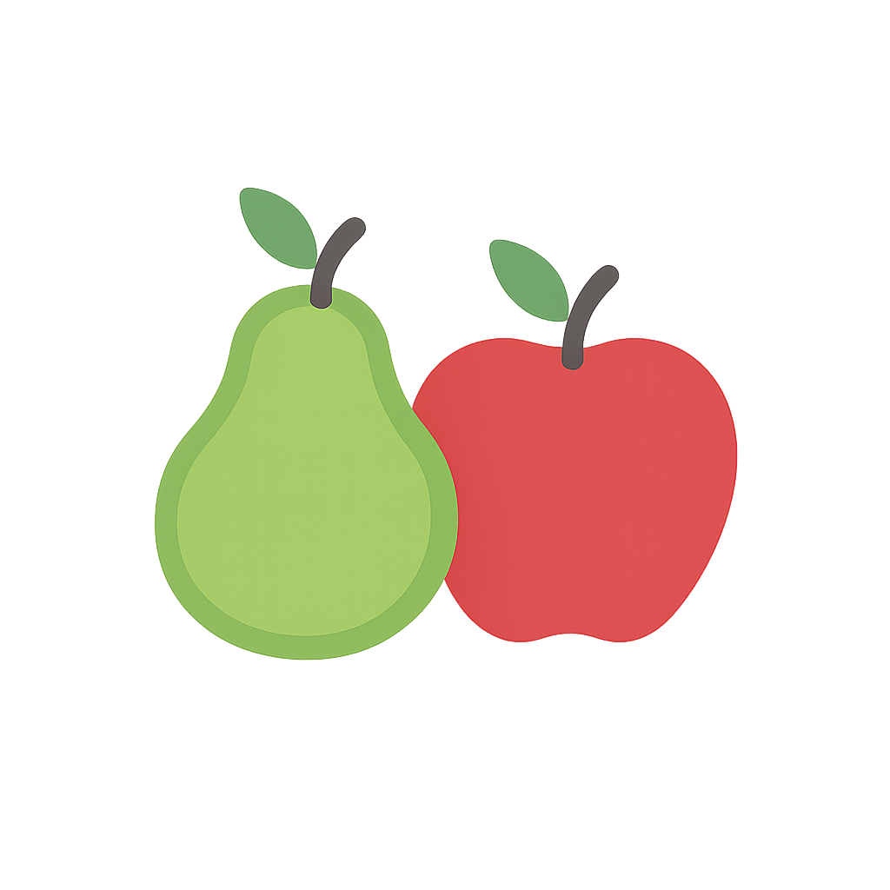
</p>

Este proyecto es una mini aplicación nativa para Android, desarrollada en Kotlin, que refactoriza y adapta el Gestor de Tareas V3 (basado en MVVM) para convertirlo en un Gestor de Finanzas Personales. El objetivo es ilustrar la gestión completa del ciclo de vida de una Transacción (Ingreso o Gasto) de manera reactiva y eficiente, manteniendo el patrón Model-View-ViewModel (MVVM) para una clara separación de responsabilidades.

La presente versión 1.0 reutiliza la arquitectura de persistencia local (archivo CSV) y la lógica de negocio, modificando los modelos y repositorios para gestionar Montos y Categorías en lugar de Tareas y Eventos. Utiliza LiveData y Coroutines para notificar a la UI (Fragments) sobre cambios que ocurren en tiempo real, garantizando la persistencia y la gestión de la información financiera.

**Nota**: Se reutiliza la base funcional del Caso AE3-ABP1 Gestor de Tareas V3.

---

## 🎯 Requerimientos de Funcionalidad

1. Registrar Transacciones con monto, descripción, tipo (Ingreso/Gasto) y categoría.
2. Listar las Transacciones registradas aplicando filtros y ordenamiento sobre los datos.
3. Sumarizar las transacciones por tipo y calcular el Saldo Total (Ingresos - Gastos) y mostrarlo de forma reactiva a la interfaz.
4. Gestionar correctamente el ciclo de vida de Activities y Fragments.
5. Agregar y gestionar Fragments dinámicamente con paso de parámetros.
6. Implementar un RecyclerView para mostrar la lista de transacciones.
7. Proporcionar feedback visual al usuario sobre los cambios de estado (uso de toasts).

---

## 🧠 Requerimientos Técnicos y Arquitectura MVVM

Se mantiene la Arquitectura MVVM heredada, que proporciona una clara separación de responsabilidades para manejar datos financieros:

1. Modelo (Model) y Persistencia

   - **Modelo de Datos (Transaction)**: Clase de datos que define la estructura de una transacción (monto, tipo, categoría).
   - **Repositorio (TransactionRepository)**: Centraliza el acceso a los datos. Es responsable de la persistencia local (archivo **transacciones.csv**) y ejecuta todas las operaciones de I/O de forma asíncrona.

2. ViewModel (TransactionViewModel)

   - Hereda de AndroidViewModel y utiliza viewModelScope para lanzar corrutinas.
   - Mantiene la lógica de negocio financiera (cálculo de saldo, filtrado), manipula los datos del Repositorio y expone el estado de la aplicación a través de LiveData (ej. allTransactions, currentBalance, statusMessage).

3. Vista (View)

   - MainActivity y Fragments (ListaTransaccionesFragment y RegistroTransaccionFragment).
   - La Vista solo observa los LiveData expuestos por el TransactionViewModel y actualiza la UI de forma reactiva, sin manipular directamente los datos ni conocer la fuente de persistencia.

4. Otros aspectos técnicos
   - Se respeta la lógica de Splash Screen integrada en MainActivity para mantener la estructura heredada.
   - Creación y añadido de Fragments de forma dinámica usando método de factoría (newInstance).
   - Implementa un Adapter personalizado para el RecyclerView.
   - Uso de bundle para pasar datos (ej. al Fragment de edición de una transacción).

## ✨ Características y Usabilidad

1.  **Arquitectura MVVM**: Implementación estricta de MVVM utilizando LiveData para la reactividad y Coroutines/viewModelScope para la gestión asíncrona de datos.
2.  **Gestión de Transacciones**: Permite registrar, modificar y eliminar transacciones, capturando información esencial (Monto, Tipo, Descripción, Fecha, Categoría).
3.  **Cálculo Reactivo de Saldo**: La vista principal (ListaTransaccionesFragment) muestra el saldo total en tiempo real, actualizándose inmediatamente después de cada registro, modificación o eliminación.
4.  **Navegación Unificada**: La lógica de navegación ha sido centralizada en la BottomNavigationView y gestionada por la MainActivity mediante transacciones de Fragments.
5.  **Persistencia Local con Repositorio**: La aplicación utiliza un archivo transacciones.csv como almacenamiento persistente, gestionado internamente por el TransactionRepository.

---

## 🛠️ Tecnologías usadas

- IDE: Android Studio (Narwhal 3, basado en IntelliJ IDEA)
- Plataforma: Android Nativo
- SDK mínimo: 29
- SDK Target: 36
- Kotlin: 1.9.22
- Java: 21
- Arquitectura: MVVM (Model-View-ViewModel).
- Concurrencia: Kotlin Coroutines y viewModelScope.
- Comunicación Reactiva: LiveData.
- UI/Navegación: Activity, Fragment y BottomNavigationView
- Almacenamiento: Archivos CSV (ubicados en getExternalFilesDir(null), en el dispositivo)
- Otras tecnologías: Git, Github, Github Desktop.

---

## 💾 Estructura de Datos (CSV)

El archivo transacciones.csv se compone de 6 atributos, reflejando el nuevo modelo Transaction:

| Campo       | Descripción                                      | Tipo de Dato |
| ----------- | ------------------------------------------------ | ------------ |
| ID          | UUID de la Transacción                           | String       |
| Título      | Título de la transacción (ej. 'Pago Arriendo')   | String       |
| Monto       | Cantidad de dinero                               | Double       |
| Tipo        | Tipo de Transacción (Ingreso, Gasto)             | String       |
| Categoría   | Clasificación (Supermercado, ocio, trabajo, etc) | String       |
| Descripción | Breve descripción                                | String       |
| Fecha       | Fecha                                            | String       |
| Hora        | Hora                                             | String       |

## 🏗️ Funcionamiento de la Aplicación

El flujo base es el siguiente:

1. **Inicio y Navegación**: La aplicación muestra la pantalla de bienvenida y luego la MainActivity orquesta la navegación a través de la BottomNavigationView entre VerTareasFragment (Agenda) y CrearTareaFragment.
2. **Vista Agenda (VerTareasFragment)**:
   - Observa el taskViewModel.allTasks (LiveData).
   - Cuando el ViewModel actualiza esta lista, el RecyclerView se redibuja automáticamente (reactividad).
   - Maneja la acción de eliminar o marcar como completada, llamando a los métodos correspondientes en el ViewModel.
3. **Crear/Editar Evento (CrearTareaFragment)**:
   - El usuario ingresa o edita los datos.
   - Al presionar "Guardar" o "Actualizar":
     - Se realiza la validación de campos obligatorios.
     - Si se requiere alarma (Notificación), se verifica/solicita el permiso de Notificaciones (POST_NOTIFICATIONS) usando registerForActivityResult.
     - Se llama a taskViewModel.saveOrUpdateTask(), que ejecuta la lógica de persistencia en el TaskRepository fuera del hilo principal.
     - La vista (Fragment) observa el taskViewModel.statusMessage para mostrar un Toast de confirmación de forma segura.
     - Finalmente, la vista navega de vuelta a la Agenda.
4. Cada transacción dispone de un ícono de **_"EDICIÓN"_** , y uno para su **_"ELIMINACIÓN"_**, y se pueden seleccionar para ejecutar estas acciones.

## Capturas de Pantalla

<p float="left">
  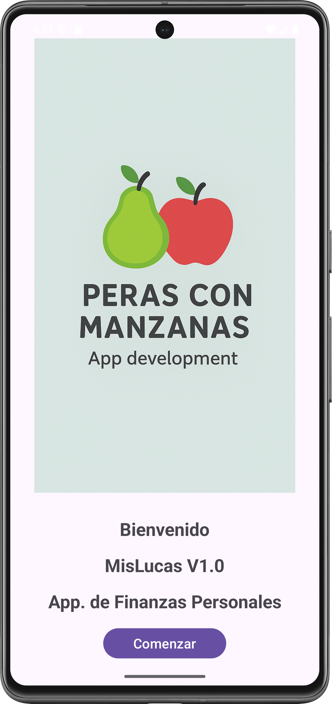  
  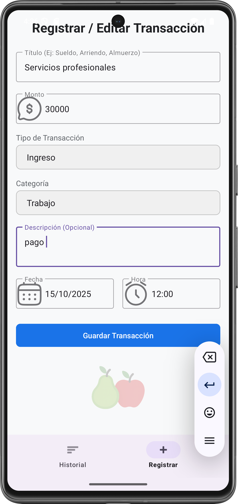
  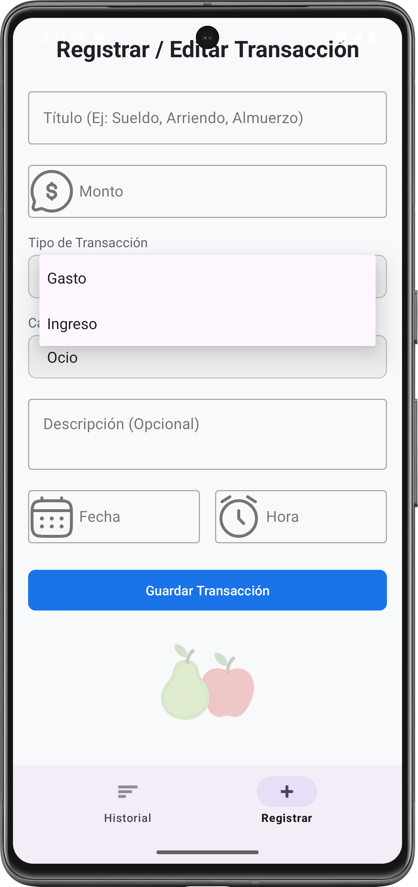
  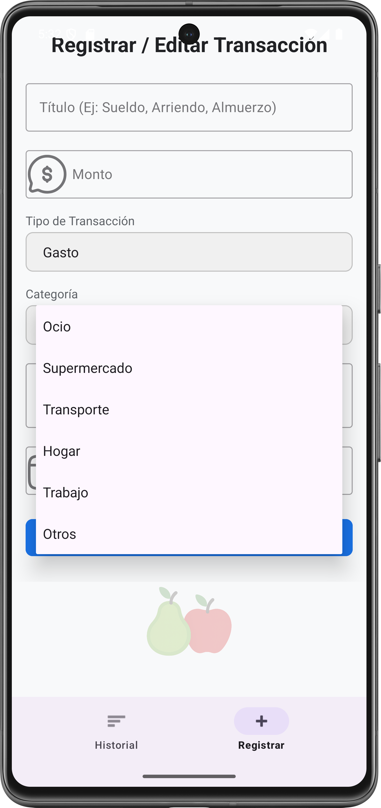
  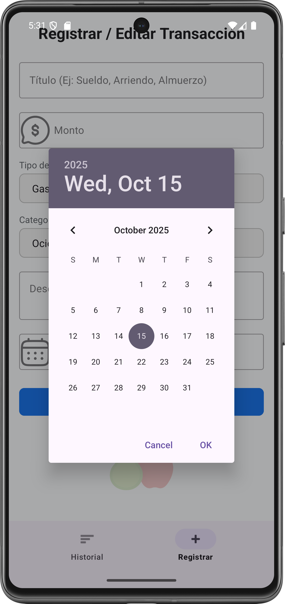
  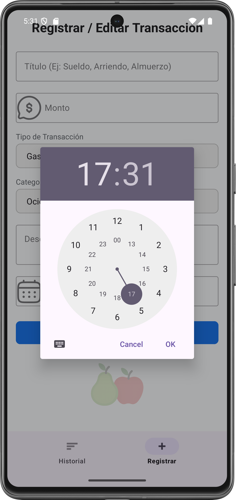    
  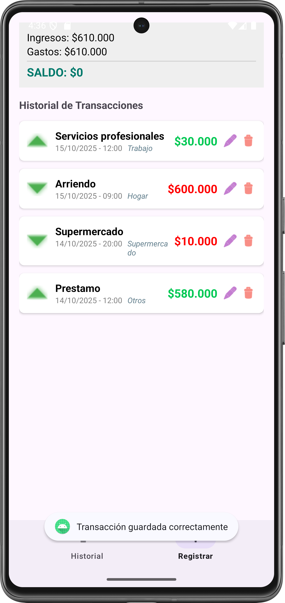
  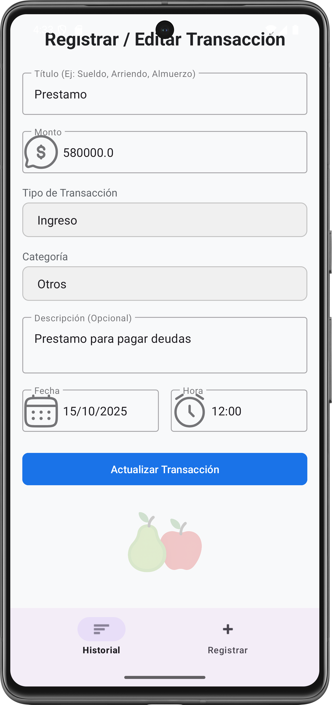  
  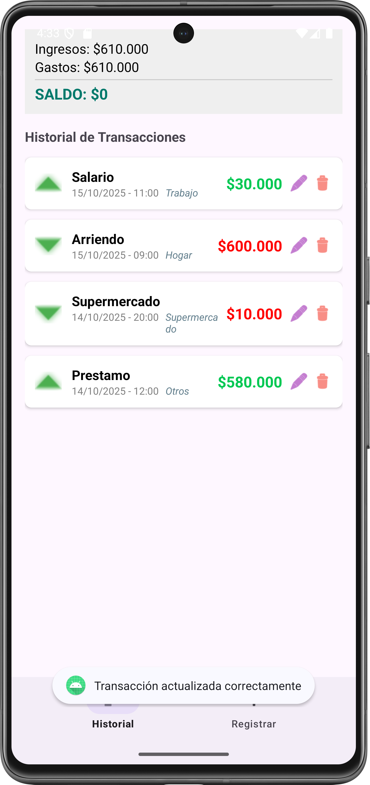
  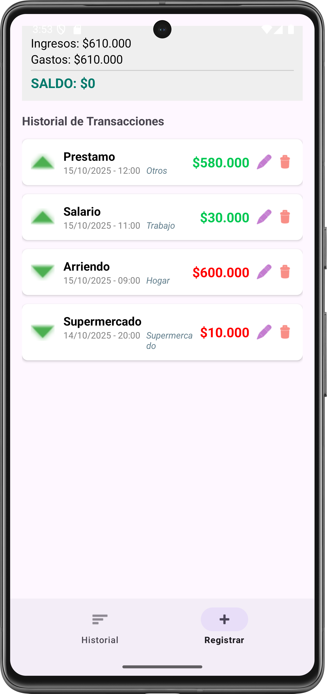
  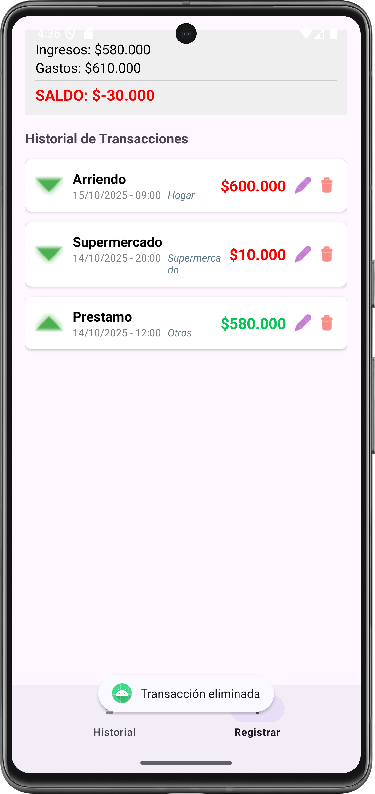
  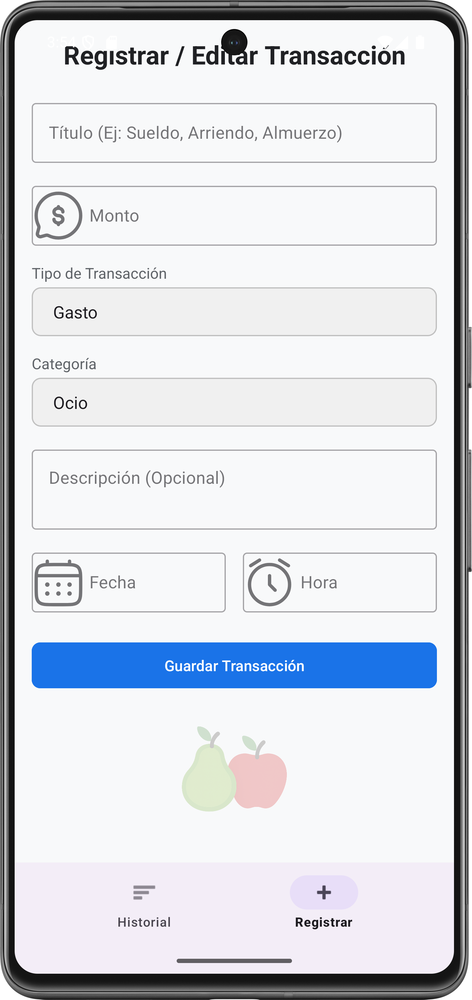  
</p>

## Guía de Ejecución del Proyecto

**Para ejecutar este proyecto en tu entorno de desarrollo, siga estos 'quick steps':**

1.**Clonar el Repo:** Clona el proyecto en su máquina local.

2.**Abrir en Android Studio:** Abra la carpeta del proyecto con Android Studio. El IDE detectará automáticamente la configuración de Gradle.

3.**Sincronizar Gradle:** Haz clic en el botón "Sync Now" si Android Studio te lo solicita. Esto descargará todas las dependencias necesarias.

4.**Ejecutar:** Conecta un dispositivo Android físico o inicia un emulador. Luego, haz clic en el botón "Run 'app'" (el ícono de la flecha verde) para desplegar la aplicación.

**Para ejecutar este proyecto en tu celular, sigue estos 'quick steps':**

1.**Copiar la APK:** Copia la aplicación (APK) en tu celular.

2.**Instalar:** Instala la aplicación, salta los avisos de advertencia, es normal si la aplicación no ha sido productivizada la plataforma de Android.

3.**Abrir la App:** Haz doble clic en el ícono "Agenda".

4.**Recorrer las opciones:** Cliquea en las opciones y podrás acceder al listado de eventos, editar cada evento, crear nuevos eventos, regresando a cualquier punto de la app.

## Instalación y Configuración

a. **Clonar el repositorio:**

```bash

https://github.com/jcordovaj/ae3_abpro1_MisLucas.git

```

b. **Abrir el Proyecto en Android Studio:**

b.1. Abrir Android Studio.

b.2. En la pantalla de bienvenida, seleccionar **"Open an existing Android Studio project"** (Abrir un proyecto de Android Studio existente).

b.3. Navegar a la carpeta donde se clonó el repositorio y seleccionarla. Android Studio detectará automáticamente el proyecto de Gradle y comenzará a indexar los archivos.

c. **Sincronizar Gradle:**

c.1. Este es el paso más importante. Después de abrir el proyecto, Android Studio intentará sincronizar la configuración de Gradle. Esto significa que descargará todas las librerías, dependencias y plugins necesarios para construir la aplicación. Normalmente, una barra de progreso se mostrará en la parte inferior de la consola de Android Studio con un mensaje como **"Gradle Sync in progress"**.

c.2. Si no se inicia, o si el proceso falla, intente con el botón **"Sync Project with Gradle Files"** en la barra de herramientas. Es el icono con el **"elefante" de Gradle**. Eso forzará la sincronización.

c.3. Esperar que el proceso de sincronización termine. De haber errores, puede ser por problemas en la configuración de Android u otros conflictos, la aplicación debe descargar lo que requiera y poder ser ejecutada "AS-IS".

d. **Configurar el Dispositivo o Emulador:**

Para ejecutar la aplicación, se requiere un dispositivo Android, puedes usarse el emulador virtual o un dispositivo físico.

d.1. Emulador: En la barra de herramientas, haga click en el botón del "AVD Manager" (Android Virtual Device Manager), que es el icono de un teléfono móvil con el logo de Android. Desde ahí, puedes crear un nuevo emulador con la versión de Android que prefiera (Nota: Debe considerar que cada celular emulado, puede requerir más de 1GB de espacio en disco y recursos de memoria).

d.2. Dispositivo físico: Conecte su teléfono Android a la computadora con un cable USB (también puede ser por WI-FI). Asegúrese de que las **Opciones de desarrollador y la Depuración por USB** estén habilitadas en su dispositivo. Consulte a su fabricante para activar estas opciones.

e. **Ejecutar la aplicación:**

e.1. Seleccione el dispositivo o emulador deseado en la barra de herramientas del emulador.

e.2. Haga click en el botón "Run 'app'" (el triángulo verde en la parte superior, o vaya al menu "RUN") para iniciar la compilación y el despliegue de la aplicación, puede tardar algunos minutos, dependiendo de su computador.

e.3. Si todo ha sido configurado correctamente, la aplicación se instalará en el dispositivo y se iniciará automáticamente, mostrando la pantalla de inicio.

## Contribuciones (Things-To-Do)

Se puede contribuir reportando problemas o con nuevas ideas, por favor respetar el estilo de programación y no subir código basura. Puede utilizar: forking del repositorio, crear pull requests, etc. Toda contribución es bienvenida.

## Licencia

Proyecto con fines educativos, Licencia MIT
